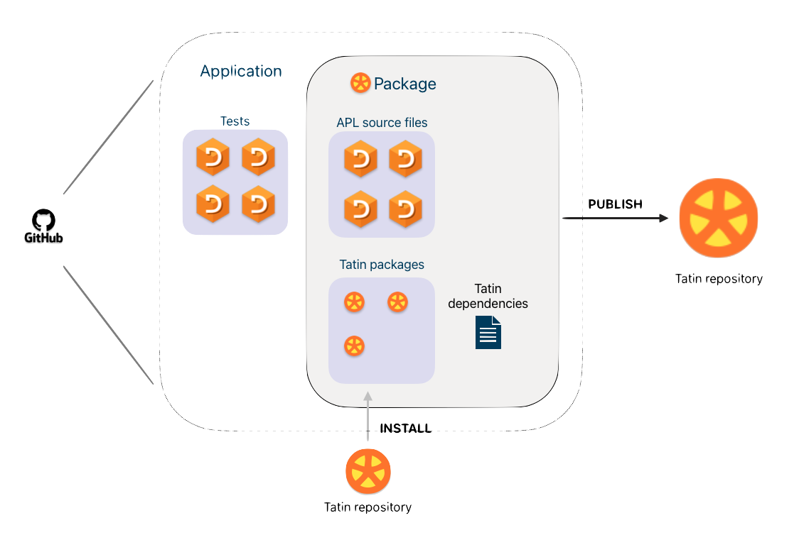

# About Tatin

!!! abstract "Tatin is the community cross-platform package manager for Dyalog APL"

Tatin is a package manager: it lets APL developers share reusable libraries and manage their dependencies.

The diagram illustrates an APL application defined in [Linked](https://dyalog.github.io/link/4.0/) text files, and held on a GitHub repository.
It depends on APL libraries in the form of Tatin packages imported from a Tatin registry.

In the example, the application does not just *consume* Tatin packages.
Its working parts, excluding the tests but including the dependencies, 
are also published as a new Tatin package.

As shown, one package may depend on another, and so on.
Tatin manages these dependencies.

The Tatin [Principal Registry](https://tatin.dev) hosts packages with minimal licence restrictions.
You can also host a Tatin registry on your local machine or on a server.

## Where packages are installed

Package managers generally follow one of two strategies: installing packages to the operating system so they are available machine-wide, or installing them per application so each project carries its own dependencies.

System-wide installation means one copy of a package is shared by everything on the machine. This saves disk space but makes version conflicts much more likely, and potentially numerous: if project A needs version 1.2.0 of a library and project B needs version 1.5.0, one of them loses. It also makes projects less portable — a project that relies on system packages works correctly only on machines where those packages are already installed.

Tatin follows the per-application strategy. When you install a package into a project, it is placed in the project's package installation folder and stays there. Projects are therefore self-contained: move a project to a different machine and its dependencies travel with it. The trade-off is some duplication if many projects share the same packages, but in practice this is rarely significant.

## :dyalog-tatin-logo: Packages

A package should serve a particular, limited task, for example, converting Markdown files into HTML. 

It may be as simple as a single source file, or multiple folders and source files. 

It may include other assets:
CSS files, BAT files, icons, images, config files, documentation, DLLs, etc.

It may depend on other packages: Tatin manages the dependencies behind the scenes.

!!! detail "Tatin package licences impose few restrictions on your use of the software."

## Versions and dependencies

_All things must change._
In general a package exists as a series of versions.

A package that depends on another package usually depends on either a specific or a *minimum* version of it.
Upgrading might require newer versions of packages on which it in turn depends.

Tatin follows the [semantic versioning](semantic-versioning.md) conventions
and silently [manages all this](load-and-update-strategy.md) for you.

To support this work, the Principal Registry never deletes a published package.
You can *deprecate* a package or a version, but the registry retains it for anyone who relies on it.

## :dyalog-cider-logo: Cider and Tatin

[Cider](https://aplteam.github.io/Cider) is the project manager for Dyalog APL.

Like Tatin, it works with APL source files created and managed by [Link](https://dyalog.github.io/link/4.0/). 

Tatin is all you need in order to consume packages.
Cider extends Tatin with tools for managing versions and tests.

If you foresee publishing software for others to use, 
either as Tatin packages or as an application or Web service, 
it might suit you to start with Cider and let it manage Tatin.

## Usage

There are two ways to use Tatin.

-   **User commands** such as `]TATIN.ListRegistries` put Tatin at your fingertips
-   **API functions** such as `⎕SE.Tatin.ListRegistries` let you write DevOps scripts 

## Requirements

* Dyalog Unicode Edition Version 18.2 or better. (Classic is not supported.)
* [Link](https://dyalog.github.io/link/4.0/) Version 3.0.8 or better
* The Tatin client runs on Windows, Linux, macOS and Raspberry Pi.
* The Tatin registry runs on Windows as a service or a Docker container and on Linux as a Docker container. (It might run on macOS as a Docker container, but this has not been tested.)

??? warning "A file for each object"

    Tatin requires its source files to carry exactly one APL object each: a function, operator, array, class, interface, or a namespace.

    Dyalog APL supports multiple APL objects in a single text file; Tatin does not.

## Community

You can contribute to the [Principal Registry](https://tatin.dev): report errors (open issues in the package repositories), or submit pull requests if you can see how to fix them.

Please also consider [publishing](publish-packages.md) your own work as Tatin packages.

Besides the Principal Registry, you can [host your own Tatin registry](host.md).

Tatin is itself a community project, hosted on GitHub. It is open source and community-maintained.

You are very welcome to [contribute](contribute.md) to it.

## Licences

Tatin is a community project. It is published under the (pretty relaxed) [MIT license](https://en.wikipedia.org/wiki/MIT_License).

Packages hosted on the Principal Registry make the software available with minimal restrictions. That's because you can publish to it only when you accept one of the license offered, all of which are relaxed.
